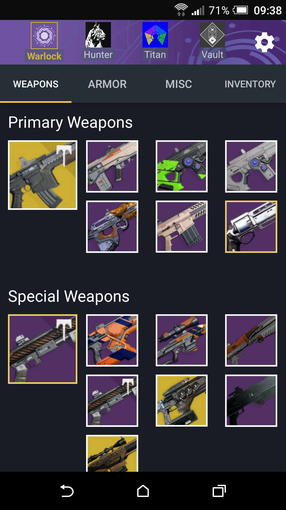
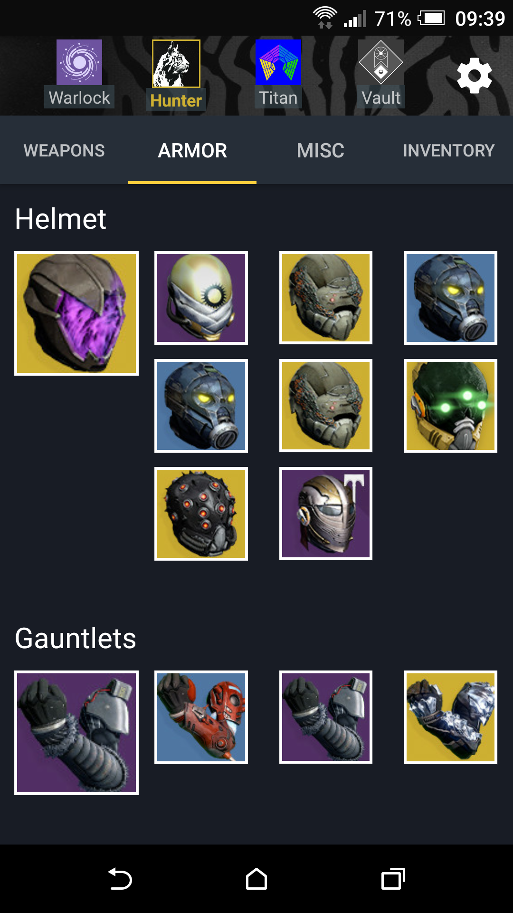
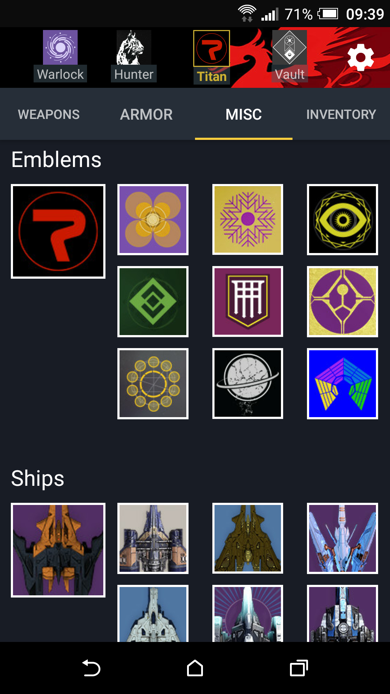
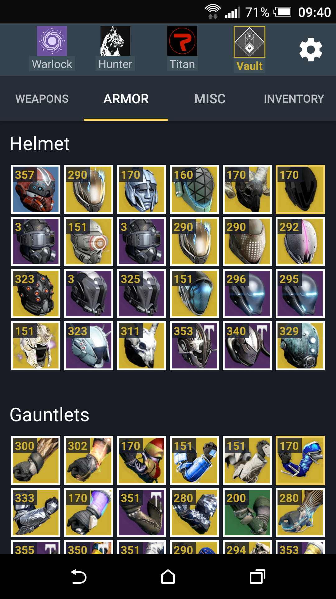
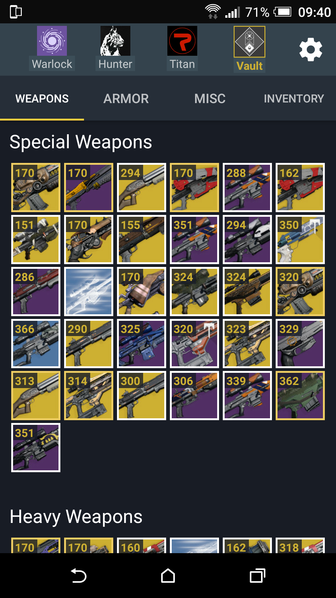
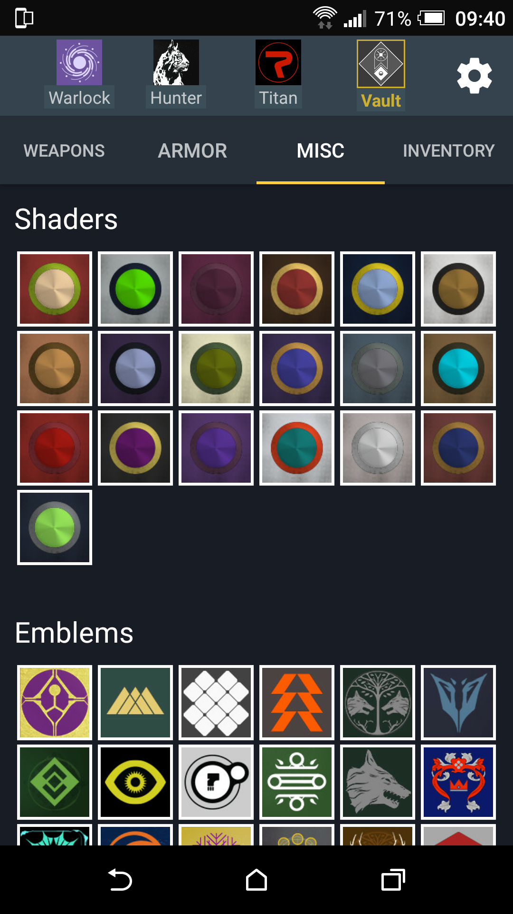
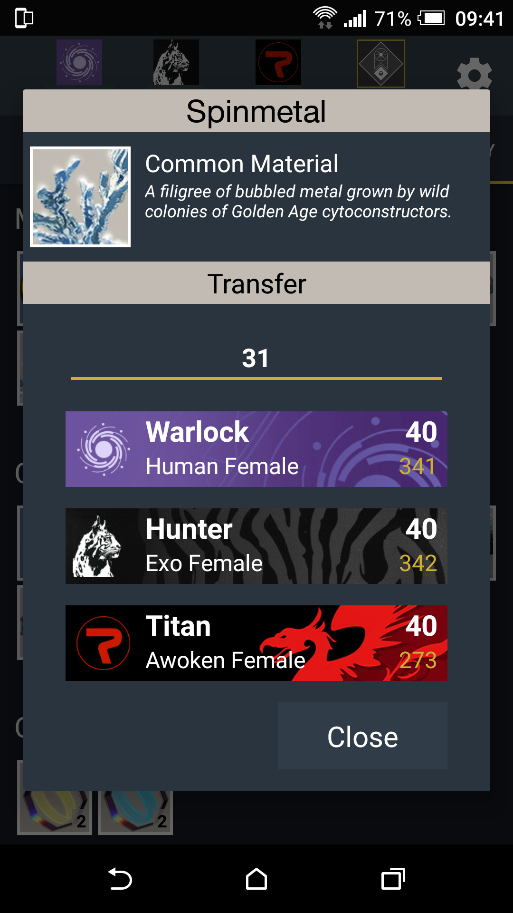
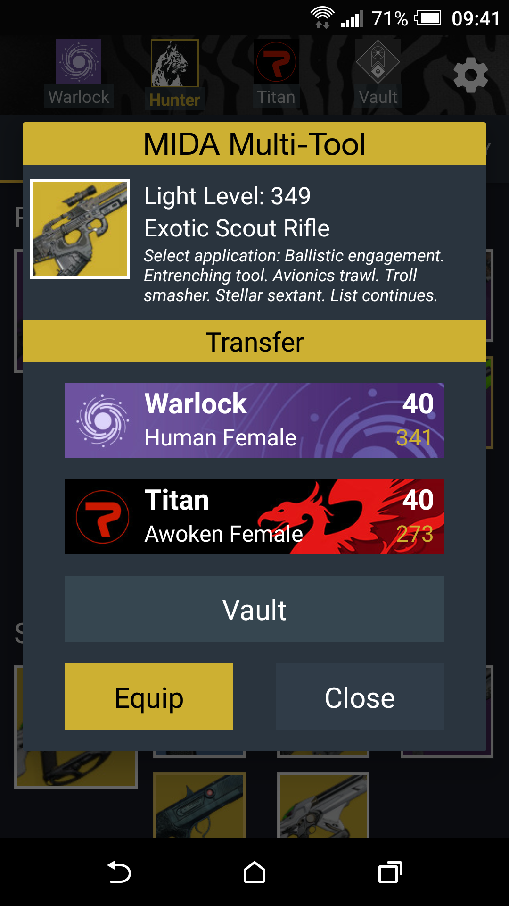

# Project #4: The Vault: Item Manager for Destiny

## Overview

The Vault is a FREE item manager application for the massively popular shared-world shooter game; Destiny.

The Vault is created keeping the hardcore and casual players in mind and minimises the time and effort required to equip an item, to transfer an item to or from the Vault and to transfer an item between your characters.

The Vault is created by the players; for the players. We know that Guardians want to spent the least amount of time possible navigating through their inventory to equip or transfer items. Therefore; The Vault focuses on speed more than anything else. The application is lightning-fast to launch & show your items and is always responsive.

Grind Mode: An Automated Inventory Clean-up Feature
The most frustrating thing when you are in a great fire team and completing consecutive strikes, raids, events is getting your inventory filled up with engrams. The Vault has a "Grind Mode" feature that you can turn on with single tap. Grind Mode periodically checks your characters' inventories for engrams and transfers them to your Vault; so that you always have space for new epic loot.

[Google Play Link](https://play.google.com/store/apps/details?id=com.crocusgames.destinyinventorymanager)

### Screenshots:

### Android Technologies Used:
 - Sync Adapter (Chosen for backwards compatibility)
 - Oath Authentication
 - Broadcast Manager
 - Detail Fragments
 - View Pager Adapter
 - Gson/JSON
 - Notifications
 - SQLite Databases
 - RecyclerView Adapter
 - Volley
 - Picasso

### Research & Proposal Documents:
 - [Destiny Item Manager - Research Plan](https://docs.google.com/document/d/11aUGUM8KTE3C7SqByC450IG8Fh931FOnXxrsVdZ8iSA/edit?usp=sharing)
 - [Research Highlights](https://docs.google.com/document/d/11EvSyXtI64p5rG5loaGDQDZaGFvWAIDIaTVni_5XK50/edit?usp=sharing)
 - [Problem Statement](https://docs.google.com/document/d/1GqekcCC3T7ydm-tjsWuPrrVPAJluH--Fi0JHNal7j_o/edit?usp=sharing)
 - [User Persona](https://docs.google.com/document/d/1wJpeRsb56YgfMtktrpfDeiqlzJ-tvBr_cbHRDV-hT0A/edit?usp=sharing)
 - [Project Proposal](https://docs.google.com/presentation/d/1dNNo7gtm4c-i-i_u4YwfUKoUVgM8-XkpIZpzMuf_SXY/edit?usp=sharing)

### [User Stories Document](https://docs.google.com/document/d/1ZkC8KLIcY_G5Knu_a1aeSGKyF5CPY4hDAQQfHvZ029c/edit?usp=sharing)

### Paper Prototyping images can be found on in the folder “paper_prototypes”

### Known issues:
 - The espresso test is not applicable for this application as the application needs the oath authentication at launch. The espresso test is unable to follow the steps that happen in the web view.
 - There are no non-android methods used in the application; therefore there are no unit tests.
 
### Note:
 - A Playstation account is needed to test the app. I will share my account credentials with Charlie & Drew via Slack.

---

## Licensing
1. All content is licensed under a CC­BY­NC­SA 4.0 license.
2. All software code is licensed under GNU GPLv3. For commercial use or alternative licensing, please contact [legal@ga.co](mailto:legal@ga.co).
