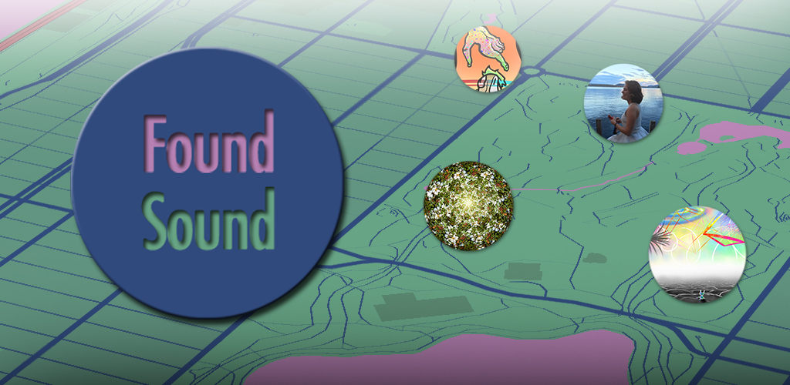
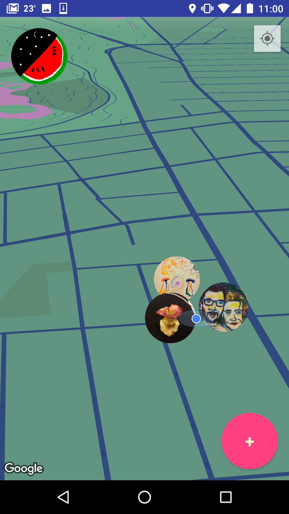
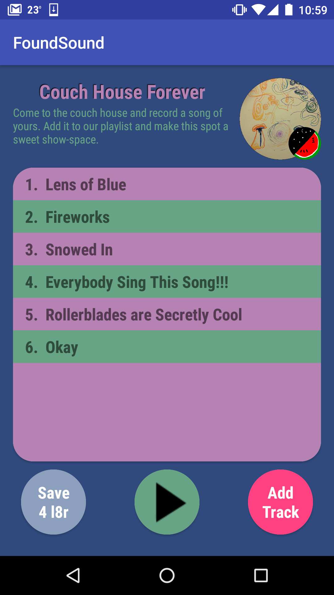

#Found Sound

 

#Features
##---Cool Map

- Look at that map, it's a pretty sweet looking map. The colors and angle make it feel like a new world.
- You can walk around and see little circles with images inside. Those are playlists that people created.
- If you click one, it'll tell you to get closer. Get within a short distance of it and you'll be able to access it.
- Or you can make your own playlist at your location!

##---Playlists

- When you create or open a playlist, it's saved to that location.
- You can play whatever tracks are on there. Those are recordings people submitted.
- You can record anything you want to this playlist.
- Since it's locked to location, you might not be able to see it again if you move out of range, so there is a save4later feature.
- You can add a picture for the album cover.
- You can check out the cover in big style.

##---Color

- Make your own user icon. It's sort of sound graffiti so the fact that nobody has a user name is purposeful.
- See other people's user icons when they make a playlist and song.

#Technologies
##---

   
  

###BUGS

- Crashes randomly sometimes, maybe onRestart crashes it?
- User icons don't know up on songs.
- There are multiple maps activities on top of themselves sometimes.
- Playing a track doesn't change anything except the play button.
- Deleting tracks doesn't delete the song-list on the database.
