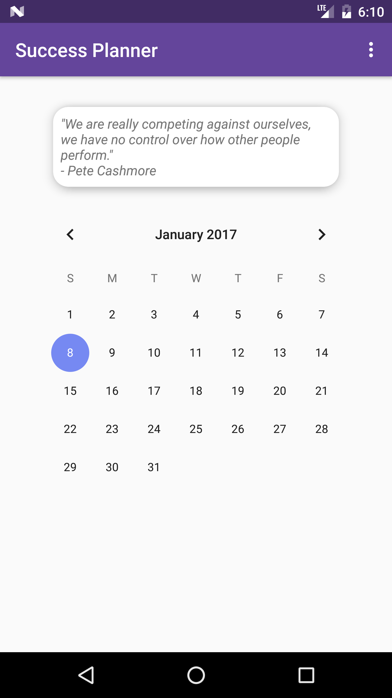
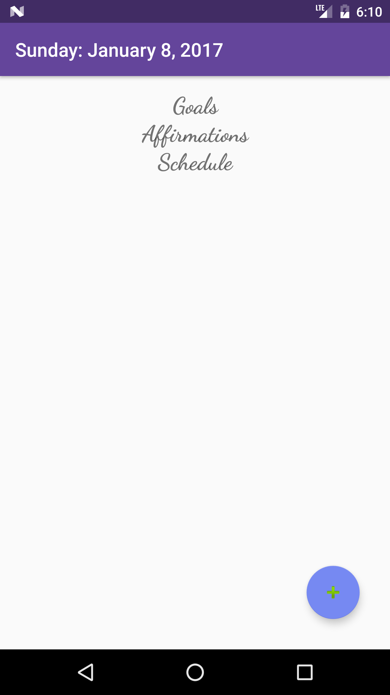
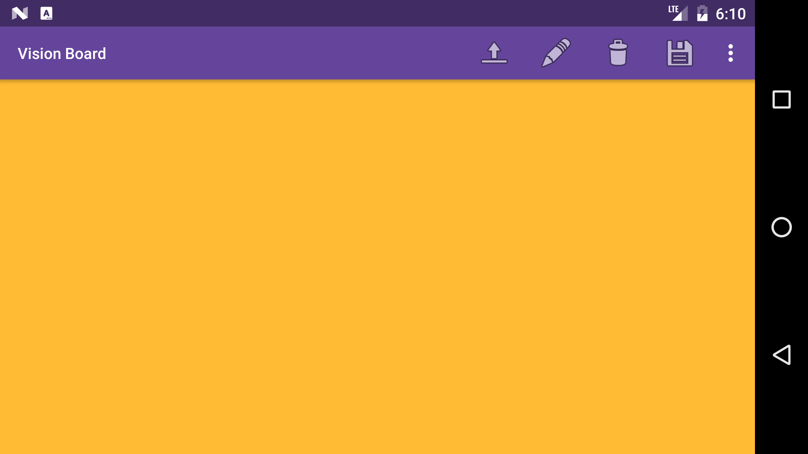

## Success Planner

People who gear themselves for success usually set goals and affirmations.  In addition, have a daily planner to keep track of their progress and results.  There are not many apps available which allow people to do all this in one.  As well, as be able to create a vision board within the same app.

Success Planner allows users to add and keep tract of their goals, affirmations and schedule on the daily bases.  When opening the app users will be greeted with inspirational quotes to help motivate them to achieve your desires.  Success Planner has a feature that allow users to customize their own vision board.  Users are able to upload images, add new text unto the screen, change color and size of text and save the vision board to their phone.

**Bugs:**

- TimePickerDialog does not display in landscape orientation
- Some large images will not display, it is suggested to upload small images

**Links**

- [Google Play Store](https://play.google.com/store/apps/details?id=com.ezequielc.successplanner)
- [Research](https://github.com/ECarrasco91/project-4/blob/master/research.md)
- [Proposal](https://docs.google.com/presentation/d/16EDCtTSFGSfDBakbkrer4D0NAPZZImLj4Qv0tzWPKBI/edit?usp=sharing)
- [User Stories](https://docs.google.com/document/d/1NFzWOASMm_YFJ5ntT0hQggXwbm9ATxPCOMTLIcaT_ZE/edit?usp=sharing)

  
  
  

