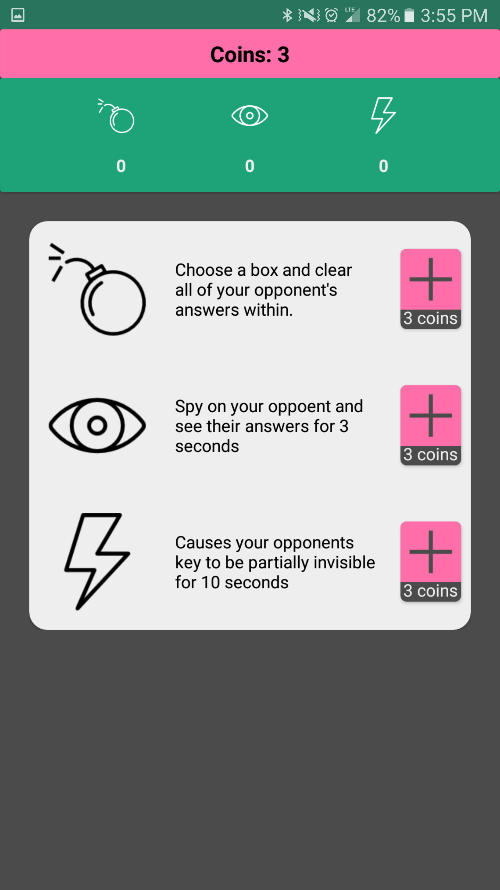

#  Su you think you can Doku

## Overview

**A sudoku game featuring a multiplayer race mode**

This app showcases a blend of logic and UI design. 

Games in general require a great deal of logic to maintain a set of rules and expectations. But playing a game that involves a logic-based puzzle is an even greater challenge. The app contains a sudoku puzzle solver that is capable of finding the solution to any puzzle in a short amount of time. By utilizing this solver, only the keys (not the solutions) to puzzles need to be stored in both the remote and local databases. Thus cutting down storage size by a factor of two.

My go to game on the subway is always sudoku. I found that a sudoku app with a dissatifying and or clumbsy UI would almost always lead me to uninstalling. There are many designs that are superior to So you think you can Doku, but it is my believe that navigating about within the game is both simple and intuitive. The puzzle interface itself is designed with speed in mind. By taking a minimalistic approach, the user does not have to perform any unnecessary steps to place input into a cell.

The race mode is the leading feature of the app. Using Google Play Game Services, oppoenents sign in with a Google account and are then matched up in a real-time-multiplayer room. As the users attempt to solve the same puzzle, one can see when the other inputs an answer into a cell. The input itself is not revealed, but only indicated through a color tint. In addition, there are weapons the users can throw as one another. Yes, weapons in a sudoku game.

- Erase Bomb:
  The user long presses on one of the nine large boxes to clear all of the opponents answers (not including the key) inside that box.
- Spy:
  A passive weapon, the user can peek at their opponent's answers for three seconds.
- Interference:
  Amazingly frustrating, this weapon obscures half the the puzzles key for a few seconds.... and then the other half.
  
Weapons can be purchased using coins in the armory. 5 coins are awarded upon winning a race.

There are 5 acheivements to be unlocked:
- Beginner's Luck: 5 points
  Win 1 race
- No Spring Chicken: 10 points
  Win 10 races
- Soldier: 75 points
  Win 50 races
- Oh you, you CAN doku: 150 points
  Win 100 races
- Bow to the King: 200 points
  Win 200 races

**Google Play Store Link**

Download the app [here](https://play.google.com/store/apps/details?id=com.scottlindley.suyouthinkyoucandoku).

   
   

